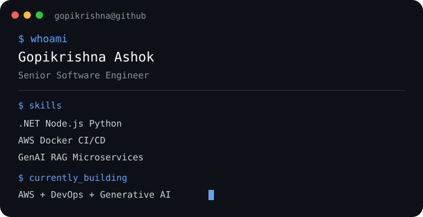

# 👋 Hi, I'm Gopikrishna Ashok

### Senior Software Engineer · AWS · DevOps · Generative AI

I build **cloud-native applications, backend services, and AI-powered solutions** using modern engineering practices.

My current focus is combining **AWS, DevOps, and Generative AI** to build production-ready systems.

---

## 🧑‍💻 About Me

  

- 💼 Senior Software Engineer
- ☁️ AWS & Cloud-native development
- ⚙️ DevOps, Docker & CI/CD
- 🤖 Generative AI & RAG
- 🔧 Backend development with .NET, Node.js & Python
- 🏗️ Interested in scalable microservices & cloud architecture
- 🚀 Currently building and experimenting with AWS + AI projects

---

## 🛠️ Tech Stack

### Languages
`C#` `C` `Python` `JavaScript` `Node.js`

### Backend
`ASP.NET Web API` `ASP.NET MVC` `REST APIs` `Microservices` `LINQ`

### AWS
`Lambda` `API Gateway` `Bedrock` `S3` `DynamoDB` `SQS` `SNS`  
`EventBridge` `CloudWatch` `IAM` `CloudFormation` `ECR`

### DevOps
`Docker` `GitHub Actions` `Jenkins` `CI/CD` `AWS CodePipeline`  
`CodeBuild` `CodeArtifact`

### AI / Data
`Amazon Bedrock` `RAG` `Knowledge Bases` `Generative AI`  
`MySQL` `Redis` `Snowflake`

---

## 🚀 Featured Project

### 🤖 Bedrock Document Q&A

A cloud-native **Retrieval-Augmented Generation (RAG)** application built using AWS.

**Architecture & Technologies**

`Amazon Bedrock` · `RAG` · `Lambda` · `API Gateway` · `S3`  
`DynamoDB` · `Redis` · `Docker` · `ECR` · `GitHub Actions`

The application allows users to upload documents and ask questions using a conversational AI interface.

🔗 **[View Project →](https://github.com/GopikrishnaAshok/bedrock-doc-qa)**

---

## 📈 What I'm Currently Exploring

AWS Cloud Architecture
        +
DevOps & CI/CD
        +
Generative AI
        +
RAG
        +
MLOps
        ↓
Production-ready AI Systems

---

## 🤝 Connect With Me

📧 **Email:** Coming soon  
💼 **LinkedIn:** Coming soon

---

⭐ If you find my projects interesting, feel free to explore my repositories.